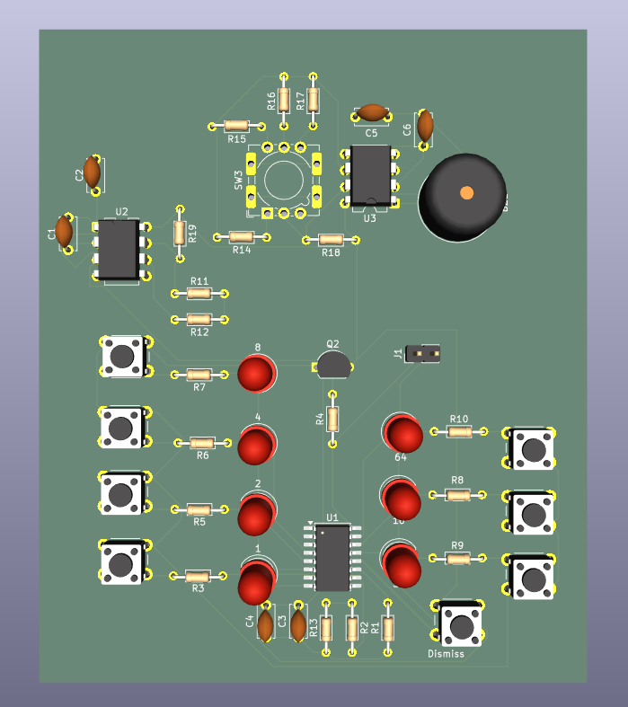
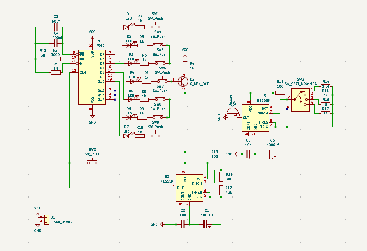
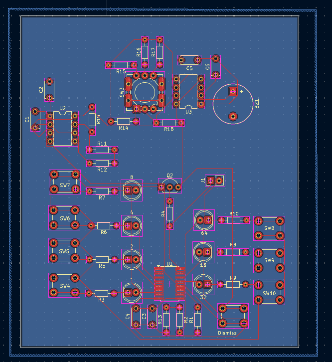

#Basic-Timer

This is a timer made using one CD4060 IC and two NE555 IC with values of 1, 2, 4, 8, 16, 32 and 64 mins and with different ringtones that can be changed by rotationg a button.

##Schematic

## PCB

